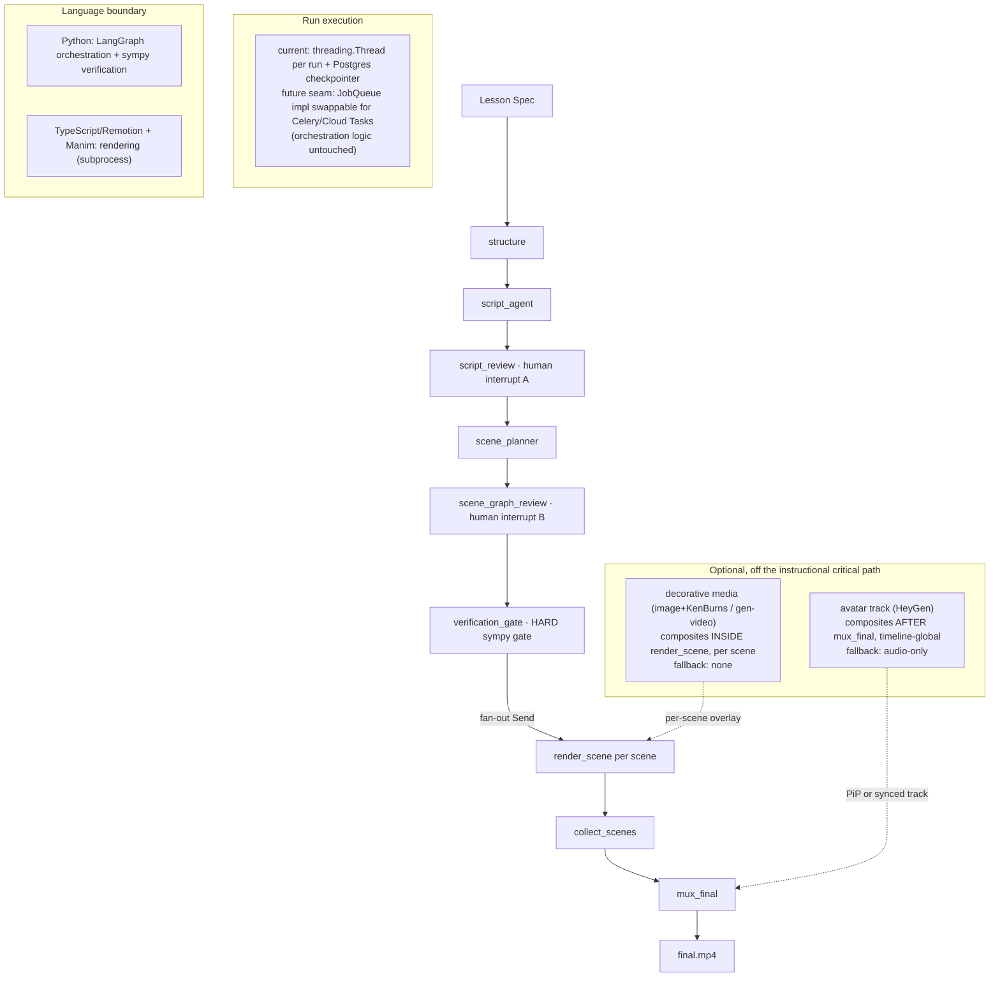

# Spectacle Hardening Implementation Plan

> **For agentic workers:** REQUIRED SUB-SKILL: Use superpowers:subagent-driven-development (recommended) or superpowers:executing-plans to implement this plan task-by-task. Steps use checkbox (`- [ ]`) syntax for tracking.

**Goal:** Harden the Spectacle local POC toward small-scale production by making caching/versioning honest and correct, wiring in content safety, replacing the macOS-only TTS stub, adding CI, adding advisory evaluators, and scaffolding the optional decorative-media and avatar layers — without weakening the symbolic verification gate.

**Architecture:** Python (LangGraph + sympy) owns orchestration and verification; TypeScript/Remotion owns layout rendering; Manim owns equation scenes. This language split is deliberate and stays. Every pipeline stage writes a content-addressed artifact; this plan makes that content-addressing *actually* skip work across runs (today only the render stage and same-thread checkpointer do) and makes artifact identity reflect the real model/prompt/voice inputs.

**Tech Stack:** Python 3.14, LangGraph, pydantic v2, sympy, Manim, FFmpeg (subprocess), Remotion (Node/TS), FastAPI, Postgres (checkpointer + artifact metadata), pytest.

## Global Constraints

- **Do not weaken `domains/education/src/spectacle_education/verification.py:sympy_equivalence_gate` or its hard-gating in `packages/core/src/spectacle_core/nodes/verification_gate.py`.** It must keep raising `VerificationBlockedError` before any render, in every run mode.
- **Do not widen `packages/core/src/spectacle_core/safety.py:SAFE_EXPRESSION_RE`** to support variables/algebra. That is a real future task but is out of scope here. If it blocks something, stop and flag it.
- **Core never imports from `domains/`.** (CLAUDE.md rule 1.) Domain packs plug in via the `DomainPack` protocol only.
- **Instructional content stays deterministic** (Manim/Remotion). Generative video and avatar are additive, optional, and must never sit on the instructional critical path.
- **Python 3.14**, pydantic v2 (`model_dump(mode="json")`, `model_validate`). Follow existing test idioms: patch module-level functions with `unittest.mock.patch`, use `LocalFileArtifactStore(tmp_path)`, hash via `spectacle_core.hashing.content_hash`.
- **Commit after every green step.** Branch off `main`; the human pushes (do not push unless asked).

## Settled design decisions (context — do not re-litigate)

These were decided in the audit + design review that produced this plan.

1. **Storage stays output-addressed; caching adds an input→output pointer.** Artifacts keep being stored under their own content hash (stable identity, needed for a later golden-reference dataset). Cache-skipping is done via a separate *input key* that points at the output content hash. Do **not** switch artifact storage to input-addressed.
2. **`node_version` becomes a computed fingerprint** over (model id + static prompt template + sampling params), not a hand-typed string. Changing a prompt auto-invalidates the cache.
3. **Only the two LLM nodes get cache-skipping:** `structure` and `script_agent`. `scene_planner` (deterministic lookup) and `verification_gate` (cheap deterministic sympy, guarantee = "always runs") stay always-run.
4. **The render stage becomes a 3-key DAG:** `audio_key → video_key → final_key`. `video_key` includes the audio *duration* and computed reveal-timing, so a voice change re-renders video only if it actually shifts timing. This also cleanly separates audio from the silent instructional video (the code already renders silent video + muxes narration on afterward), which is what lets the avatar later occupy the "narration" slot.
5. **The narration provider returns a bundle, not a bare float.** `NarrationResult{audio_path, duration_s, avatar_video_path: str | None}`. TTS fills the first two today; HeyGen fills all three later with no call-site changes. Duration is always the timing master regardless of provider.
6. **`SafetyProfile` gets wired as a hard gate — explicitly documented as an exception** to "only deterministic checks block," justified because a false positive routes to the existing human-review interrupt. (Contrast: Phase 5 evaluators are advisory, never blocking.)
7. **Advisory evaluators write to a `warnings` sidecar, never into the hashed artifact** (nondeterministic LLM output inside a hashed model would poison the Phase 1 cache).
8. **Decorative media composites inside `render_scene` (per-scene); avatar composites after `finalize.py` concat (timeline-global).** Two different attach points. Phase 6 builds only the seams + data models + compositing logic — no live HeyGen/gen-video API calls unless separately asked.
9. **Queue: define the seam, not a distributed queue.** Phase 1 introduces a `JobQueue` interface backed by the current thread-per-run mechanism. No Celery/Cloud Tasks now.
10. **Golden-dataset training is deferred.** Don't build evaluator training/calibration. Just don't design artifact IDs or storage in a way that makes later golden-pair association awkward (output-addressed content hashes already satisfy this).

## Execution model

Phases are ordered by dependency and each ends with shippable, tested software. **Phase 1 is load-bearing for Phases 3 and 5** (its cache-key/versioning design is what they plug into) — do it before them. After each phase, a "Re-audit before continuing" note lists what to sanity-check. Phases 2, 4 are independent and can be reordered if convenient.

Dependency sketch:

```
Phase 0 (docs)  ──▶ Phase 1 (versioning + cache DAG + queue seam)
                         ├──▶ Phase 3 (TTS bundle, uses render DAG + voice-in-key)
                         └──▶ Phase 5 (warnings sidecar, uses artifact identity)
Phase 2 (safety gate)   ─ independent
Phase 4 (CI)            ─ independent
Phase 6 (scaffolding)   ─ after Phase 1 (attaches to render DAG + finalize)
```

---

## Phase 0 — Documentation honesty + system diagram

**No code paths change.** Goal: stop the README from claiming caching that doesn't exist yet, and give the next reader (and the executor of later phases) an accurate map.

**Files:**
- Modify: `README.md`

- [ ] **Step 1: Correct the caching claims.** Find the section that currently says nodes are skipped when an artifact exists (around the "Content-addressed artifacts" heading, ~README.md:55-57). Replace the overstated claim with an accurate description:

```markdown
### Content-addressed artifacts

Every pipeline stage produces a pydantic model that embeds its upstream hash
and a `node_version` string, stored under the SHA-256 of its canonical JSON.

**What actually skips work today (pre-hardening):**
- The **render stage** skips a scene whose `scene_input_hash()` already has a
  `scene_final.mp4` in the store (`nodes/render_scene.py`).
- **Same-thread resume**: LangGraph's Postgres checkpointer replays a run from
  its last completed node after a crash/interrupt.

**What does NOT skip yet:** `structure`, `script_agent`, `scene_planner`, and
`verification_gate` re-run on every fresh run, even for an unchanged spec.
(Cross-run skipping for the two LLM nodes is added in the hardening plan,
Phase 1.)
```

- [ ] **Step 2: Add a Mermaid system diagram.** Add under the "How it works" section:

````markdown

````

- [ ] **Step 3: Add a blunt "Known gaps" section.** Add near the end of the README:

```markdown
## Known gaps (as of this writing)

- No golden dataset of spec→video pairs; no calibrated evaluators.
- No CI (added in hardening Phase 4).
- TTS is macOS-only `say`, no SSML/lexicon (replaced in Phase 3).
- No generative-video or avatar integration (only scaffolded in Phase 6).
- Runs are versioned and cache-correct but NOT bit-reproducible: Anthropic
  has no deterministic seed, so identical inputs can yield different outputs.
- Content safety: see Phase 2 (wired) — before that, `SafetyProfile` was
  declared but unenforced.
```

- [ ] **Step 4: Commit.**

```bash
git add README.md
git commit -m "docs: correct caching claims, add system diagram + known gaps"
```

**Re-audit before continuing:** Re-read the diagram against `graph.py`'s `build_graph` edges — confirm node order matches exactly. No behavior to test.

---

## Phase 1 — Versioning, cross-run cache, render DAG, queue seam

This is the load-bearing phase. Four deliverables, each independently testable: (1.1) computed version fingerprints, (1.2) an input→output node cache used by the two LLM nodes, (1.3) the audio→video→final render DAG with voice in the key, (1.4) the `JobQueue` seam.

**Files:**
- Create: `packages/core/src/spectacle_core/versioning.py`
- Create: `packages/core/src/spectacle_core/node_cache.py`
- Create: `packages/core/tests/test_versioning.py`
- Create: `packages/core/tests/test_node_cache.py`
- Modify: `packages/core/src/spectacle_core/nodes/script_agent.py` (attach fingerprint to `default_script_llm`)
- Modify: `domains/education/src/spectacle_education/structure_agent.py` (attach fingerprint to the LLM fns)
- Modify: `packages/core/src/spectacle_core/graph.py` (wrap the two LLM nodes with the cache)
- Modify: `packages/core/src/spectacle_core/nodes/render_scene.py` (3-key DAG)
- Modify: `packages/core/src/spectacle_core/models.py` (`SceneGraphEntry` audio/video/final key helpers)
- Modify: `packages/core/src/spectacle_core/tts.py` (add `identity()` to the provider protocol)
- Create: `apps/server/src/server/job_queue.py`
- Modify: `apps/server/src/server/run_manager.py` (route execution through `JobQueue`)
- Create: `apps/server/tests/test_job_queue.py`

### Task 1.1: Computed version fingerprints

**Interfaces:**
- Produces: `spectacle_core.versioning.compute_fingerprint(node_name: str, model_id: str, prompt_template: str, params: dict) -> str` returning `f"{node_name}@{hex12}"`.

- [ ] **Step 1: Write the failing test.**

```python
# packages/core/tests/test_versioning.py
from spectacle_core.versioning import compute_fingerprint


def test_fingerprint_starts_with_node_name():
    fp = compute_fingerprint("script_agent", "claude-haiku-4-5", "TEMPLATE", {"max_tokens": 400})
    assert fp.startswith("script_agent@")


def test_fingerprint_changes_when_prompt_changes():
    a = compute_fingerprint("script_agent", "m", "TEMPLATE A", {})
    b = compute_fingerprint("script_agent", "m", "TEMPLATE B", {})
    assert a != b


def test_fingerprint_changes_when_model_changes():
    a = compute_fingerprint("script_agent", "model-1", "T", {})
    b = compute_fingerprint("script_agent", "model-2", "T", {})
    assert a != b


def test_fingerprint_is_stable_for_same_inputs():
    a = compute_fingerprint("n", "m", "T", {"p": 1})
    b = compute_fingerprint("n", "m", "T", {"p": 1})
    assert a == b
```

- [ ] **Step 2: Run to verify it fails.** `pytest packages/core/tests/test_versioning.py -v` → FAIL (module missing).

- [ ] **Step 3: Implement.**

```python
# packages/core/src/spectacle_core/versioning.py
from spectacle_core.hashing import content_hash


def compute_fingerprint(node_name: str, model_id: str, prompt_template: str, params: dict) -> str:
    """A deterministic identity for a node's *code + model config*, distinct
    from its input data. Folded into artifact node_version and the node cache
    key so that changing a prompt/model/params auto-invalidates the cache
    without a human bumping a version string."""
    digest = content_hash({"model": model_id, "template": prompt_template, "params": params})
    return f"{node_name}@{digest[:12]}"
```

- [ ] **Step 4: Run to verify it passes.** `pytest packages/core/tests/test_versioning.py -v` → PASS.

- [ ] **Step 5: Attach a fingerprint to each real LLM function.** In `script_agent.py`, after `_SCRIPT_TOOL` and the prompt are defined, add a module-level constant and attach it:

```python
# packages/core/src/spectacle_core/nodes/script_agent.py  (near top-level, after _SCRIPT_TOOL)
import json as _json
from spectacle_core.versioning import compute_fingerprint

_SCRIPT_MODEL = "claude-haiku-4-5-20251001"
# The static template = the tool schema + the fixed instruction skeleton.
# (Per-stub content enters the cache key via the upstream ContentTree hash,
# so it must NOT be part of the fingerprint.)
_SCRIPT_TEMPLATE = _json.dumps(_SCRIPT_TOOL, sort_keys=True)
SCRIPT_AGENT_FINGERPRINT = compute_fingerprint(
    "script_agent", _SCRIPT_MODEL, _SCRIPT_TEMPLATE, {"max_tokens": 400, "tool_choice": "any"}
)
default_script_llm.fingerprint = SCRIPT_AGENT_FINGERPRINT  # set after def
```

Place `default_script_llm.fingerprint = SCRIPT_AGENT_FINGERPRINT` *after* the `def default_script_llm` block. Do the same in `structure_agent.py` for the content-hint/guided-practice fns (one shared fingerprint `STRUCTURE_FINGERPRINT` attached to `default_content_hint_llm` and `default_guided_practice_expression_llm`).

- [ ] **Step 6: Stamp the fingerprint into the Script artifact.** In `run_script_agent`, set `node_version` from the llm_fn's fingerprint (falling back for stubs that don't set one):

```python
# in run_script_agent, replace the final return
fingerprint = getattr(llm_fn, "fingerprint", "script_agent@stub")
return Script(node_version=fingerprint, tree_hash=tree_hash, scenes=scenes)
```

(`Script.node_version` already exists as a field; this just makes it meaningful. Confirm `Script` still validates — `node_version` is a plain `str`.)

- [ ] **Step 7: Test the stamping.**

```python
# add to packages/core/tests/test_script_agent.py
def test_script_node_version_comes_from_llm_fingerprint():
    from spectacle_core.domain_pack import ContentTree, SceneStub
    from spectacle_core.nodes.script_agent import run_script_agent, ScriptLLMResponse

    def fake_llm(stub):
        return ScriptLLMResponse(narration_text="hi", on_screen_text="Hi")
    fake_llm.fingerprint = "script_agent@abc123"

    tree = ContentTree(spec_hash="x", scenes=[
        SceneStub(scene_id="intro_1", render_hint="layout", content_hint="c",
                  target_duration_s=20.0, verify=False)])
    script = run_script_agent(tree, llm_fn=fake_llm)
    assert script.node_version == "script_agent@abc123"
```

- [ ] **Step 8: Run + commit.** `pytest packages/core/tests/test_script_agent.py packages/core/tests/test_versioning.py -v` → PASS.

```bash
git add packages/core/src/spectacle_core/versioning.py packages/core/tests/test_versioning.py packages/core/src/spectacle_core/nodes/script_agent.py domains/education/src/spectacle_education/structure_agent.py packages/core/tests/test_script_agent.py
git commit -m "feat: computed version fingerprints for LLM nodes"
```

### Task 1.2: Input→output node cache

**Interfaces:**
- Produces: `spectacle_core.node_cache.node_input_key(upstream_hash: str, fingerprint: str) -> str`
- Produces: `spectacle_core.node_cache.cached_or_compute(store, input_key: str, compute: Callable[[], BaseModel], model_cls: type[BaseModel]) -> BaseModel` — returns the cached artifact (loaded via the pointer) if present, else runs `compute()`, stores the output under its own content hash, writes the pointer, and returns it.
- Consumes: `ArtifactStore` protocol from `artifacts.py`; `content_hash` from `hashing.py`.

- [ ] **Step 1: Write the failing test.**

```python
# packages/core/tests/test_node_cache.py
from pydantic import BaseModel
from spectacle_core.artifacts import LocalFileArtifactStore
from spectacle_core.node_cache import node_input_key, cached_or_compute


class _Art(BaseModel):
    node_version: str = "n@1"
    value: str
    def compute_hash(self) -> str:
        from spectacle_core.hashing import content_hash
        return content_hash(self.model_dump(mode="json"))


def test_input_key_is_deterministic_and_namespaced():
    a = node_input_key("upstreamhash", "script_agent@abc")
    b = node_input_key("upstreamhash", "script_agent@abc")
    assert a == b and len(a) == 64


def test_miss_runs_compute_and_stores_output(tmp_path):
    store = LocalFileArtifactStore(tmp_path)
    key = node_input_key("u", "fp")
    calls = []
    def compute():
        calls.append(1)
        return _Art(value="hello")
    result = cached_or_compute(store, key, compute, _Art)
    assert result.value == "hello"
    assert len(calls) == 1
    assert store.exists(key)  # pointer written


def test_hit_skips_compute(tmp_path):
    store = LocalFileArtifactStore(tmp_path)
    key = node_input_key("u", "fp")
    cached_or_compute(store, key, lambda: _Art(value="hello"), _Art)

    def exploding():
        raise AssertionError("compute must not run on a cache hit")
    result = cached_or_compute(store, key, exploding, _Art)
    assert result.value == "hello"
```

- [ ] **Step 2: Run to verify it fails.** `pytest packages/core/tests/test_node_cache.py -v` → FAIL.

- [ ] **Step 3: Implement.**

```python
# packages/core/src/spectacle_core/node_cache.py
from typing import Callable
from pydantic import BaseModel
from spectacle_core.artifacts import ArtifactStore
from spectacle_core.hashing import content_hash


def node_input_key(upstream_hash: str, fingerprint: str) -> str:
    """Input identity for a node: upstream artifact hash + code/model
    fingerprint. The 'kind' field namespaces these away from real content
    artifacts stored in the same root."""
    return content_hash({"kind": "node_input", "upstream": upstream_hash, "fp": fingerprint})


def cached_or_compute(store: ArtifactStore, input_key: str, compute: Callable[[], BaseModel],
                      model_cls: type[BaseModel]) -> BaseModel:
    if store.exists(input_key):
        output_hash = store.get_json(input_key)["output_hash"]
        return model_cls.model_validate(store.get_json(output_hash))
    artifact = compute()
    output_hash = artifact.compute_hash()
    store.put_json(output_hash, artifact.model_dump(mode="json"))
    store.put_json(input_key, {"output_hash": output_hash})
    return artifact
```

- [ ] **Step 4: Run to verify it passes.** → PASS.

- [ ] **Step 5: Wire the two LLM nodes in `graph.py`.** Replace the bodies of `load_spec_and_structure` and `script_agent_node` to route through the cache. For `script_agent_node`:

```python
# in build_graph, script_agent_node
def script_agent_node(state: GraphState) -> dict:
    tree = ContentTree.model_validate(state["content_tree"])
    tree_hash = content_hash(tree.model_dump(mode="json"))
    fingerprint = getattr(script_llm_fn, "fingerprint", "script_agent@stub")
    key = node_input_key(tree_hash, fingerprint)
    script = cached_or_compute(
        store, key, lambda: run_script_agent(tree, llm_fn=script_llm_fn), Script)
    record(script.compute_hash(), "script")
    return {"script": script.model_dump(mode="json")}
```

For `structure`, compute the input key from `content_hash(spec.model_dump)` + the structure fingerprint (combine both LLM fns' fingerprints into one string). Import `node_input_key`, `cached_or_compute` at the top of `graph.py`. Note: `record(...)` still fires on a hit (so the DB/UI still sees the artifact); only the LLM call is skipped.

- [ ] **Step 6: Add a graph-level cache test.** In `test_graph_integration.py`, add a test using stub LLM fns that count calls: run the graph twice with the same spec + same `thread_id`-free fresh runs against one shared `store`, assert the stub is called on run 1 and not on run 2. (Follow the existing integration-test setup in that file for building the graph with a stub checkpointer and `MacSay`-mocked TTS.)

- [ ] **Step 7: Run full core suite + commit.** `pytest packages/core -v` → PASS.

```bash
git add packages/core/src/spectacle_core/node_cache.py packages/core/tests/test_node_cache.py packages/core/src/spectacle_core/graph.py packages/core/tests/test_graph_integration.py
git commit -m "feat: cross-run cache-skip for structure and script_agent nodes"
```

### Task 1.3: Render DAG (audio → video → final) with voice in the key

**Interfaces:**
- Produces on `SceneGraphEntry`: `audio_input_hash(voice_identity: str) -> str`, `video_input_hash(duration_ms: int) -> str`. `final` key = `content_hash({"kind":"final","audio":audio_key,"video":video_key})` computed in `render_scene`.
- Consumes: `TTSProvider.identity() -> str` (added below).

- [ ] **Step 1: Add `identity()` to the TTS protocol + MacSay.**

```python
# packages/core/src/spectacle_core/tts.py
class TTSProvider(Protocol):
    def synthesize(self, text: str, out_path: Path) -> float: ...
    def identity(self) -> str: ...

class MacSayTTSProvider:
    def identity(self) -> str:
        return "macsay:default"
    # ... existing synthesize unchanged ...
```

- [ ] **Step 2: Write failing tests for the key helpers.**

```python
# add to packages/core/tests/test_models.py
from spectacle_core.models import SceneGraphEntry

def _entry(**kw):
    base = dict(scene_id="worked_example_1", renderer="manim", narration_text="n",
                on_screen_text="3/4+1/8", target_duration_s=45.0, verify=True,
                expression="3/4 + 1/8", stated_answer="7/8", render_params={})
    base.update(kw); return SceneGraphEntry(**base)

def test_audio_hash_depends_on_narration_and_voice():
    e = _entry()
    assert e.audio_input_hash("v1") != e.audio_input_hash("v2")
    assert _entry(narration_text="a").audio_input_hash("v1") != _entry(narration_text="b").audio_input_hash("v1")

def test_video_hash_excludes_voice_but_includes_duration_and_visuals():
    e = _entry()
    assert e.video_input_hash(45000) != e.video_input_hash(46000)
    assert _entry(expression="1/2 + 1/4").video_input_hash(45000) != e.video_input_hash(45000)
```

- [ ] **Step 3: Implement the helpers on `SceneGraphEntry`** (in `models.py`):

```python
def audio_input_hash(self, voice_identity: str) -> str:
    return content_hash({"kind": "audio", "narration_text": self.narration_text,
                         "voice": voice_identity})

def video_input_hash(self, duration_ms: int) -> str:
    return content_hash({"kind": "video", "renderer": self.renderer,
                         "on_screen_text": self.on_screen_text,
                         "render_params": self.render_params,
                         "expression": self.expression,
                         "stated_answer": self.stated_answer,
                         "duration_ms": duration_ms})
```

- [ ] **Step 4: Refactor `render_scene` to the DAG.** Rewrite `render_scene` so it: (a) computes `audio_key = entry.audio_input_hash(tts_provider.identity())`; if `narration.wav` + `duration.json` exist there, load duration, else synthesize and write both; (b) computes `duration_ms = round(duration_s * 1000)` and `video_key = entry.video_input_hash(duration_ms)`; if `video.mp4` exists there, reuse, else render (preview+final for manim, single for remotion) into `video_key`; (c) computes `final_key`; if `scene_final.mp4` exists there, return it, else mux and store. Keep the timing computation (`compute_item_start_times`) exactly as-is — it feeds `video_input_hash` via `render_params`. Emit the same `notify(...)` stages (`narration_clip`, `scene_preview`, `scene_final`) and record `final_key` as the `scene_final` hash.

- [ ] **Step 5: Update `test_render_scene.py`.** The existing cache-hit test writes `scene_final.mp4` under `scene_input_hash()`; update it to write under the new `final_key`. Add a test: same scene, two different `identity()` values on the TTS ⇒ audio re-synthesized but if duration is identical, `render_manim`/`render_remotion` is NOT called the second time (video cache hit). Use call-counting fakes as in the existing tests.

- [ ] **Step 6: Run + commit.** `pytest packages/core/tests/test_render_scene.py packages/core/tests/test_models.py -v` → PASS.

```bash
git add packages/core/src/spectacle_core/models.py packages/core/src/spectacle_core/nodes/render_scene.py packages/core/src/spectacle_core/tts.py packages/core/tests/test_render_scene.py packages/core/tests/test_models.py
git commit -m "feat: 3-key render DAG (audio/video/final) with voice in cache key"
```

**Note for executor:** `SceneGraphEntry.scene_input_hash()` may still be referenced elsewhere (grep it). Leave it in place for now if other code/tests use it; the DAG helpers are additive. Flag any caller you had to change.

### Task 1.4: `JobQueue` seam

**Interfaces:**
- Produces: `server.job_queue.JobQueue` protocol with `submit(fn: Callable[[], None]) -> None`; and `ThreadJobQueue` implementing it via the current `threading.Thread(..., daemon=True)`.

- [ ] **Step 1: Write the failing test.**

```python
# apps/server/tests/test_job_queue.py
import threading
from server.job_queue import ThreadJobQueue

def test_thread_job_queue_runs_fn_off_thread():
    done = threading.Event()
    seen = {}
    def work():
        seen["tid"] = threading.get_ident()
        done.set()
    ThreadJobQueue().submit(work)
    assert done.wait(timeout=5)
    assert seen["tid"] != threading.get_ident()
```

- [ ] **Step 2: Run → FAIL.**

- [ ] **Step 3: Implement.**

```python
# apps/server/src/server/job_queue.py
import threading
from typing import Callable, Protocol

class JobQueue(Protocol):
    def submit(self, fn: Callable[[], None]) -> None: ...

class ThreadJobQueue:
    """Current execution mechanism, behind an explicit seam. Swap this for a
    Celery/Cloud Tasks-backed implementation later WITHOUT touching
    RunManager's orchestration logic."""
    def submit(self, fn: Callable[[], None]) -> None:
        threading.Thread(target=fn, daemon=True).start()
```

- [ ] **Step 4: Route `RunManager` through it.** In `run_manager.py`, accept an optional `job_queue: JobQueue = None` in `__init__` (default `ThreadJobQueue()`), and replace both `threading.Thread(target=..., daemon=True).start()` sites (`start_run`, `resume_run`) with `self.job_queue.submit(lambda: self._execute_run(...))`. Behavior is identical.

- [ ] **Step 5: Run server suite + commit.** `pytest apps/server -v` → PASS.

```bash
git add apps/server/src/server/job_queue.py apps/server/tests/test_job_queue.py apps/server/src/server/run_manager.py
git commit -m "feat: JobQueue seam (ThreadJobQueue) between RunManager and execution"
```

**Re-audit before continuing:** (1) Run a real end-to-end stub run (`stub_llm=True`) and confirm a second identical run reuses cached script + render artifacts (check the store for reused hashes). (2) Confirm the verification gate still fires — it must NOT have been folded into the node cache. (3) Grep for lingering `scene_input_hash` callers and confirm none silently bypass the new DAG.

---

## Phase 2 — Wire `SafetyProfile` as a hard gate (documented exception)

**Files:**
- Modify: `packages/core/src/spectacle_core/domain_pack.py` (nothing structural; `SafetyProfile` already exists)
- Create: `packages/core/src/spectacle_core/nodes/safety_gate.py`
- Modify: `packages/core/src/spectacle_core/graph.py` (insert node after `script_agent`, before `script_review`)
- Create: `packages/core/tests/test_safety_gate.py`
- Modify: `README.md` (update the Phase 0 "Known gaps" safety line)

**Design:** One cheap LLM call checks the generated script text against `safety_profile.disallowed_topics`; on a flagged violation it raises `SafetyBlockedError` (mirrors `VerificationBlockedError`). Injectable `safety_llm_fn` seam so tests use a fake and never hit the network. **Document in the module docstring that this is a deliberate exception to "only deterministic checks hard-block", justified because a false positive lands the human at the existing review interrupt.**

- [ ] **Step 1: Failing test.**

```python
# packages/core/tests/test_safety_gate.py
import pytest
from spectacle_core.nodes.safety_gate import run_safety_gate, SafetyBlockedError
from spectacle_core.models import Script, SceneNarration
from spectacle_core.domain_pack import SafetyProfile

_PROFILE = SafetyProfile(disallowed_topics=["violence"], age_rating="general")

def _script(text):
    return Script(tree_hash="t", scenes=[SceneNarration(
        scene_id="intro_1", render_hint="layout", narration_text=text,
        on_screen_text="Hi", target_duration_s=20.0, verify=False)])

def test_clean_script_passes():
    run_safety_gate(_script("Let's add fractions."), _PROFILE,
                    safety_llm_fn=lambda text, topics: [])  # no violations

def test_violation_raises():
    with pytest.raises(SafetyBlockedError):
        run_safety_gate(_script("graphic violence here"), _PROFILE,
                        safety_llm_fn=lambda text, topics: ["violence"])
```

- [ ] **Step 2: Run → FAIL.**
- [ ] **Step 3: Implement `run_safety_gate`** (aggregate all scenes' narration + on_screen text, call `safety_llm_fn(text, profile.disallowed_topics) -> list[str]` of matched topics, raise `SafetyBlockedError` with the matches if non-empty). Provide a `default_safety_llm` that does a single Haiku call returning matched topics as JSON, attached with its own fingerprint (reuse `compute_fingerprint`). Keep the default out of the test path.
- [ ] **Step 4: Run → PASS.**
- [ ] **Step 5: Insert the node** in `graph.py` between `script_agent` and `script_review` (`builder.add_edge("script_agent", "safety_gate"); builder.add_edge("safety_gate", "script_review")`). Thread `safety_llm_fn` through `build_graph` like `script_llm_fn`.
- [ ] **Step 6: Integration test** — a run whose stub script contains a disallowed topic ends in `error` status with the safety detail (mirror `test_graph_integration` patterns).
- [ ] **Step 7: Update README known-gaps** safety line to "wired: single-LLM topic screen, hard-gated (Phase 2)". Commit.

```bash
git add packages/core/src/spectacle_core/nodes/safety_gate.py packages/core/tests/test_safety_gate.py packages/core/src/spectacle_core/graph.py README.md
git commit -m "feat: content-safety hard gate wired from SafetyProfile"
```

**Re-audit:** Confirm the safety gate runs before any render and after script generation; confirm it's skippable ONLY via the injectable seam in tests, never silently in production.

---

## Phase 3 — Replace the TTS stub (with the narration bundle seam)

**Files:**
- Modify: `packages/core/src/spectacle_core/tts.py` (`NarrationResult`, update protocol return, real provider, lexicon, voice config)
- Create: `packages/core/src/spectacle_core/lexicon.py`
- Modify: `packages/core/src/spectacle_core/nodes/render_scene.py` (consume `NarrationResult`)
- Create/Modify tests: `packages/core/tests/test_tts.py`, `packages/core/tests/test_lexicon.py`

**Design:** Keep the `TTSProvider` seam. Change `synthesize` to return `NarrationResult{audio_path, duration_s, avatar_video_path: str | None = None}` (Decision 5) — this is the avatar seam. Add a pronunciation lexicon that pre-processes narration text (e.g. `3/4 → "three fourths"`, `x^2 → "x squared"`) before synthesis. Pin voice via a persisted config value (env/config field), surfaced through `identity()` so it flows into the audio cache key (Decision 4). Pick **one** real provider (ElevenLabs or Gemini-TTS); wire the actual API call behind the seam so tests never hit it.

- [ ] **Step 1: `NarrationResult` + protocol change (failing test first).** Test that a fake provider returning a `NarrationResult` flows through `render_scene` and the duration still drives timing. Update the existing `render_scene` tests' fake TTS to return `NarrationResult(...)` instead of a bare float.
- [ ] **Step 2: Implement `NarrationResult` (pydantic model) and update `render_scene`** to read `.duration_s` / `.audio_path`. `avatar_video_path` is threaded into the (Phase 6) composite step; for now, if present, it is ignored with a `# Phase 6` note.
- [ ] **Step 3: Lexicon (failing test → impl).** `lexicon.py: expand_math(text: str) -> str` with a small deterministic table (fractions, exponents, common operators). Test exact expansions. Apply it inside the real provider before synthesis (NOT inside MacSay, which stays as the offline default).
- [ ] **Step 4: Real provider behind the seam.** Implement `ElevenLabsTTSProvider` (or Gemini) with `identity()` returning `f"elevenlabs:{voice_id}"`, reading `voice_id` from config/env. Wrap the HTTP call so a test can patch it. Capture word-level timestamps if the API returns them and prefer them over `compute_item_start_times`' heuristic **only if** available (else fall back — do not regress).
- [ ] **Step 5: Voice config.** Add a persisted config field (env `SPECTACLE_TTS_VOICE` or a config file) and confirm changing it changes `identity()` → changes `audio_input_hash` → re-synthesizes without re-rendering unchanged video. Add a test asserting the audio key changes with voice.
- [ ] **Step 6: Confirm server-deployability** — the real provider must not depend on macOS `say`. Note this in the README known-gaps (TTS line → "real provider wired, server-deployable").
- [ ] **Step 7: Commit per sub-step.**

**Out of scope this phase:** multi-voice dialogue, multilingual. Leave `TODO(phase-later)` notes, no code.

**Re-audit:** Regenerate one scene and listen — confirm math is pronounced correctly and duration-driven timing still lines up. Confirm changing the voice does NOT needlessly re-render the deterministic video.

---

## Phase 4 — CI

**Files:**
- Create: `.github/workflows/ci.yml`

- [ ] **Step 1: Add the workflow.** On `push`/`pull_request`: set up Python 3.14, install the three packages editable (`packages/core`, `domains/education`, `apps/server`) plus test deps, run `pytest packages/core domains/education apps/server`. Add a second job: Node setup + `apps/renderer-remotion` install + `npx tsc --noEmit` (or the project's lint/typecheck). Spin up Postgres via the `services:` block for the server tests that need it (mirror `docker-compose.yml`'s credentials).

```yaml
# .github/workflows/ci.yml  (skeleton — fill package install + pg service from docker-compose.yml)
name: CI
on: [push, pull_request]
jobs:
  python:
    runs-on: ubuntu-latest
    services:
      postgres:
        image: postgres:16
        env: { POSTGRES_USER: spectacle, POSTGRES_PASSWORD: spectacle, POSTGRES_DB: spectacle }
        ports: ["5433:5432"]
        options: >-
          --health-cmd pg_isready --health-interval 10s --health-timeout 5s --health-retries 5
    steps:
      - uses: actions/checkout@v4
      - uses: actions/setup-python@v5
        with: { python-version: "3.14" }
      - run: pip install -e packages/core -e domains/education -e apps/server pytest
      - run: pytest packages/core domains/education apps/server -v
  node:
    runs-on: ubuntu-latest
    steps:
      - uses: actions/checkout@v4
      - uses: actions/setup-node@v4
        with: { node-version: "20" }
      - run: cd apps/renderer-remotion && npm ci && npx tsc --noEmit
```

- [ ] **Step 2: Verify locally** that the exact pytest/tsc commands pass before committing. **Note:** tests that shell out to `say`/`manim`/`ffmpeg` may need markers/skips in CI — audit for and skip those that require macOS-only or heavy binaries; don't let CI silently pass by not running them (log what's skipped). Commit.

```bash
git add .github/workflows/ci.yml
git commit -m "ci: run pytest + remotion typecheck on push/PR"
```

**Re-audit:** Open a throwaway PR and confirm the workflow actually runs and goes green; check nothing important was silently skipped.

---

## Phase 5 — Advisory evaluators (pedagogical spot-check + reading level)

**Files:**
- Create: `packages/core/src/spectacle_core/evaluators.py`
- Create: `packages/core/src/spectacle_core/warnings_store.py`
- Modify: `packages/core/src/spectacle_core/graph.py` (run evaluators after script, write sidecar)
- Create tests: `packages/core/tests/test_evaluators.py`, `packages/core/tests/test_warnings_store.py`

**Design (Decision 7):** Two checks, both **advisory — never raise, never block.** (1) Pedagogical fidelity: one LLM call comparing script vs `EducationSpec.learning_objective`, returns a flag + note. (2) Reading level: deterministic Flesch-Kincaid on narration text, flagged if outside an audience band. Results go to a **warnings sidecar keyed by the script's content hash**, stored OUTSIDE the hashed artifact so they can't poison the Phase 1 cache.

- [ ] **Step 1: Reading-level (deterministic, failing test → impl).** `evaluators.py: flesch_kincaid_grade(text: str) -> float` and `reading_level_warning(text, audience) -> str | None`. Test known sentences against known approximate grades (assert ranges, not exact floats).
- [ ] **Step 2: Warnings sidecar.** `warnings_store.py: put_warnings(store, artifact_hash, warnings: list[dict])` / `get_warnings(...)`. Store under a namespaced key `content_hash({"kind":"warnings","artifact":artifact_hash})` so it never collides with or mutates the artifact. Test round-trip.
- [ ] **Step 3: Pedagogical spot-check** behind an injectable `pedagogy_llm_fn` seam (fake in tests). Returns `{"on_target": bool, "note": str}`.
- [ ] **Step 4: Wire into graph** after `script_agent` (or after `safety_gate`): run both evaluators, collect warnings, `put_warnings(store, script.compute_hash(), warnings)`. Never raise. Surface warnings via the run's artifact listing (add a `warnings` field to the API's artifact response if easy; otherwise a follow-up).
- [ ] **Step 5: Tests** confirming (a) an off-target script produces a warning but the run still completes, (b) warnings are retrievable and are NOT in the script artifact JSON. Commit per sub-step.

**Re-audit:** Confirm a warning never changes the script's content hash (cache stays intact) and never blocks a render. Confirm the distinction from the verification/safety hard gates is obvious in the code.

---

## Phase 6 — Scaffolding: decorative media + avatar track

**This phase builds seams, data models, and compositing logic ONLY. No live HeyGen/gen-video API calls unless separately asked. Mark every stub explicitly in output.**

**Files:**
- Create: `packages/core/src/spectacle_core/decorative.py` (`DecorativeMediaProvider` protocol + `NullDecorativeProvider` stub)
- Create: `packages/core/src/spectacle_core/avatar.py` (`AvatarTrack` model, `AvatarProvider` protocol + stub, compositing logic)
- Modify: `packages/core/src/spectacle_core/models.py` (optional `decorative_ref` field on `SceneGraphEntry`; optional avatar fields)
- Modify: `packages/core/src/spectacle_core/nodes/render_scene.py` (per-scene decorative composite hook, fallback = none)
- Modify: `packages/core/src/spectacle_core/nodes/finalize.py` (post-concat avatar composite: flatten-PiP OR emit synced separate files)
- Create tests: `packages/core/tests/test_decorative.py`, `packages/core/tests/test_avatar.py`

- [ ] **Step 1: `DecorativeMediaProvider` protocol** — `get_clip(scene_ref, out_path) -> Path | None`; `NullDecorativeProvider` returns `None` (no media). **[STUB]**
- [ ] **Step 2: Per-scene decorative hook** in `render_scene`: if `entry.decorative_ref` and a provider yields a clip, composite it as background/overlay of the silent instructional video *before* mux; on any failure or `None`, proceed with no decorative media (must never block). Test: provider returning `None` ⇒ identical output to today; provider raising ⇒ still renders. **[REAL compositing logic, STUB provider]**
- [ ] **Step 3: `AvatarTrack` model + `AvatarProvider` stub** — `AvatarTrack{audio_aligned_to: str, video_path: str, timecode_offset_s: float}`; stub provider returns a fixed placeholder or `None`. **[STUB]**
- [ ] **Step 4: Avatar compositing in `finalize.py`** — a function taking the concatenated main video + an optional `AvatarTrack` and producing either (a) one flattened PiP MP4, or (b) two synced files sharing a timecode. Test both branches with fake inputs (small generated files via ffmpeg lavfi, as `manim_render._render_placeholder` already does). Avatar absent ⇒ today's single-file output unchanged. **[REAL compositing logic, STUB provider]**
- [ ] **Step 5: Confirm the critical path is untouched** — a full stub run with no decorative/avatar providers produces byte-for-byte the same pipeline behavior as before Phase 6 (aside from the new optional code paths being dormant). Commit per sub-step.

**Output note for executor:** In your final summary, list exactly which files are REAL (compositing logic, models, hooks) vs STUB (the three providers) so the reviewer can see what's usable today.

**Re-audit:** Confirm avatar/decorative failure or absence never blocks or alters the instructional render.

---

## Self-review checklist (run after implementing, per phase)

- **Verification gate untouched?** `git diff` on `verification.py` / `verification_gate.py` should be empty except possibly test additions. The gate still raises before render, in all run modes.
- **Cache correctness:** does any nondeterministic value (LLM warning, timestamp) live inside a hashed artifact? It must not. Sidecars only.
- **No silent gate-skips:** safety + verification are only bypassable through injected test seams, never in production config.
- **Type consistency:** `NarrationResult`, `node_input_key`, `audio_input_hash`/`video_input_hash`, `JobQueue.submit`, `AvatarTrack` — names/signatures identical everywhere they're referenced.
- **`SAFE_EXPRESSION_RE` unchanged.** If algebra support felt necessary, it's a flagged follow-up, not done here.

## Follow-ups to flag (explicitly out of scope)

- Widen `SAFE_EXPRESSION_RE` to support variables/functions so the verification gate covers algebra, not just arithmetic.
- Distributed `JobQueue` implementation (Celery/Cloud Tasks) + GCS `ArtifactStore`.
- Multi-voice dialogue + multilingual narration (per-language voice + lexicon).
- Golden-dataset evaluator training/calibration (deferred pending reference videos).
- DB connection pooling in `apps/server/src/server/db.py` (currently one connect per call).
